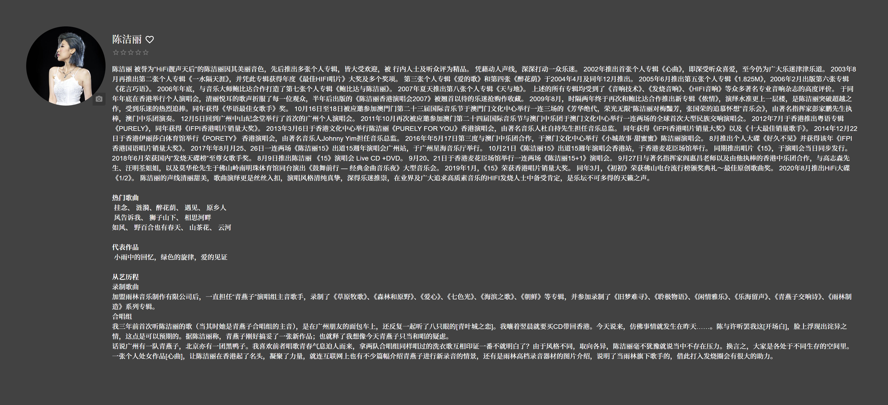

# NetEase Cloud Music Metadata Plugin for Navidrome

从网易云音乐获取艺术家和专辑元数据的 Navidrome 插件，专为中文音乐库优化。

**要求：Navidrome 0.61.0 或更新版本**

## 截图



## 功能

- 获取艺术家简介（代表作品、人物履历等完整介绍）
- 获取艺术家头像图片
- 获取艺术家热门歌曲
- 获取艺术家网易云音乐主页链接
- 获取专辑信息与描述
- 获取专辑封面图片
- 多 API 端点负载均衡，自动故障转移
- HTML 排版输出，适配 Navidrome 渲染

## 安装

1. 下载 `netease.ndp` 插件包
2. 复制到 Navidrome 插件目录（默认 `<data-directory>/plugins/`）
3. 在配置中添加 `netease` 到 `Agents`：
   ```toml
   Agents = "netease,deezer,lastfm"
   ```
4. 打开 Navidrome 后台 **设置 > 插件**，启用 **NetEase Cloud Music Metadata Agent**

## 工作原理

| 能力 | 说明 |
|------|------|
| **GetArtistBiography** | 获取完整艺术家简介 |
| **GetArtistURL** | 返回网易云音乐艺术家主页 |
| **GetArtistImages** | 获取艺术家头像 |
| **GetArtistTopSongs** | 获取热门歌曲 |
| **GetAlbumInfo** | 获取专辑信息 |
| **GetAlbumImages** | 获取专辑封面 |

1. **搜索** — 通过网易云搜索 API 查找艺术家/专辑
2. **获取** — 根据 ID 获取传记、图片、热门歌曲
3. **格式化** — 转为 HTML 输出，适配 Navidrome 渲染
4. **容错** — 多个 API 端点负载均衡，自动跳过不可用节点

## 构建

### 前置要求
- [TinyGo](https://tinygo.org/getting-started/install/)

### 编译
```sh
tinygo build -opt=2 -scheduler=none -no-debug -o plugin.wasm -target wasip1 -buildmode=c-shared .
zip -j netease.ndp manifest.json plugin.wasm
```

## 文件

| 文件 | 说明 |
|------|------|
| [main.go](main.go) | 插件实现 |
| [manifest.json](manifest.json) | 元数据和权限声明 |
| [go.mod](go.mod) | 模块依赖 |
